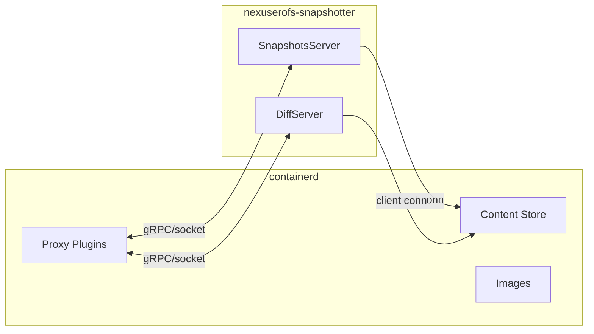

# Nexus EROFS

External snapshotter plugin for containerd that leverages EROFS (Enhanced Read-Only File System) for container image layers.

## Overview

An external EROFS snapshotter that communicates with containerd via gRPC socket. This allows using EROFS-based container layers without modifying containerd.

## Architecture



## Requirements

### Runtime

- Linux kernel with EROFS support (5.4+)
- erofs-utils 1.8+ (mkfs.erofs, fsck.erofs)
- e2fsprogs (for writable layer block mode)
- util-linux (mount, losetup)
- containerd 2.2+

### Build

- Go 1.25+
- [Task](https://taskfile.dev)

## Building

```bash
task build
```

Or cross-compile for Linux:

```bash
task build-linux
```

## Running

```bash
# Start the snapshotter daemon
sudo ./bin/nexuserofs-snapshotter \
  --root /var/lib/nexuserofs-snapshotter \
  --address /run/nexuserofs-snapshotter/snapshotter.sock \
  --containerd-address /run/containerd/containerd.sock
```

## Configuration

### containerd

```toml
# /etc/containerd/config.toml
version = 2

[proxy_plugins]
  [proxy_plugins.nexuserofs]
    type = "snapshot"
    address = "/run/nexuserofs-snapshotter/snapshotter.sock"

  [proxy_plugins.nexuserofs-diff]
    type = "diff"
    address = "/run/nexuserofs-snapshotter/snapshotter.sock"

# Use as default snapshotter
[plugins."io.containerd.cri.v1.images"]
  snapshotter = "nexuserofs"
```

### Snapshotter

The snapshotter is configured via command-line flags:

```bash
sudo ./bin/nexuserofs-snapshotter \
  --root /var/lib/nexuserofs-snapshotter \
  --address /run/nexuserofs-snapshotter/snapshotter.sock \
  --containerd-address /run/containerd/containerd.sock \
  --containerd-namespace default \
  --log-level info \
  --default-size 0 \
  --enable-fsverity=false \
  --set-immutable \
  --mkfs-options="-zlz4hc,12" \
  --mkfs-options="-C65536" \
  --overlay-options="index=off" \
  --overlay-options="metacopy=off"
```

Available flags:

| Flag | Default | Description |
|------|---------|-------------|
| `--root`, `-r` | `/var/lib/nexuserofs-snapshotter` | Root directory for snapshotter data |
| `--address`, `-a` | `/run/nexuserofs-snapshotter/snapshotter.sock` | Unix socket address |
| `--containerd-address` | `/run/containerd/containerd.sock` | containerd socket for content store |
| `--containerd-namespace` | `default` | containerd namespace |
| `--log-level` | `info` | Log level (debug, info, warn, error) |
| `--default-size` | `0` | Default writable layer size in bytes (0 = directory mode) |
| `--enable-fsverity` | `false` | Enable fsverity for layer validation |
| `--set-immutable` | `true` | Set immutable flag on committed layers |
| `--mkfs-options` | | Extra options for mkfs.erofs |
| `--overlay-options` | | Extra options for overlay mounts |

See `config/config.toml.example` for a reference configuration format.

## Project Structure

```
nexuserofs/
├── cmd/nexuserofs-snapshotter/    # Entry point, gRPC server setup
├── pkg/
│   ├── snapshotter/          # Core snapshotter implementation
│   ├── differ/               # EROFS differ implementation
│   ├── erofs/                # mkfs.erofs wrapper, mount handling
│   └── loopback/             # Loop device management
├── internal/
│   ├── cleanup/              # Cleanup utilities
│   ├── fsverity/             # fsverity support
│   ├── mountutils/           # Mount utilities
│   ├── storage/              # Storage utilities
│   └── testutil/             # Test utilities
└── config/                   # Example configuration files
```

## License

Apache 2.0
