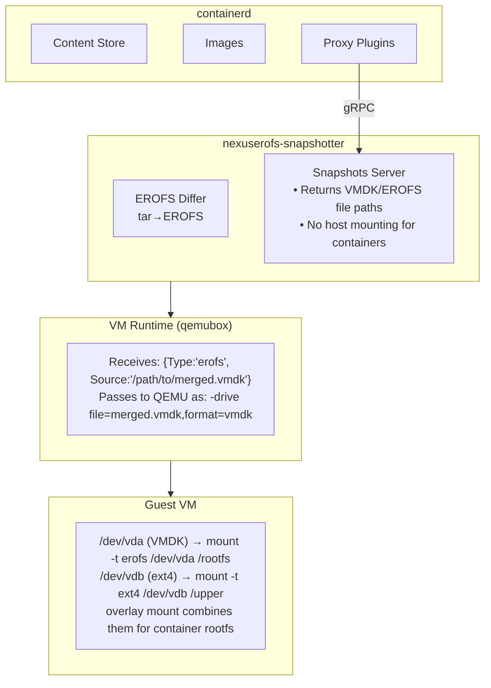
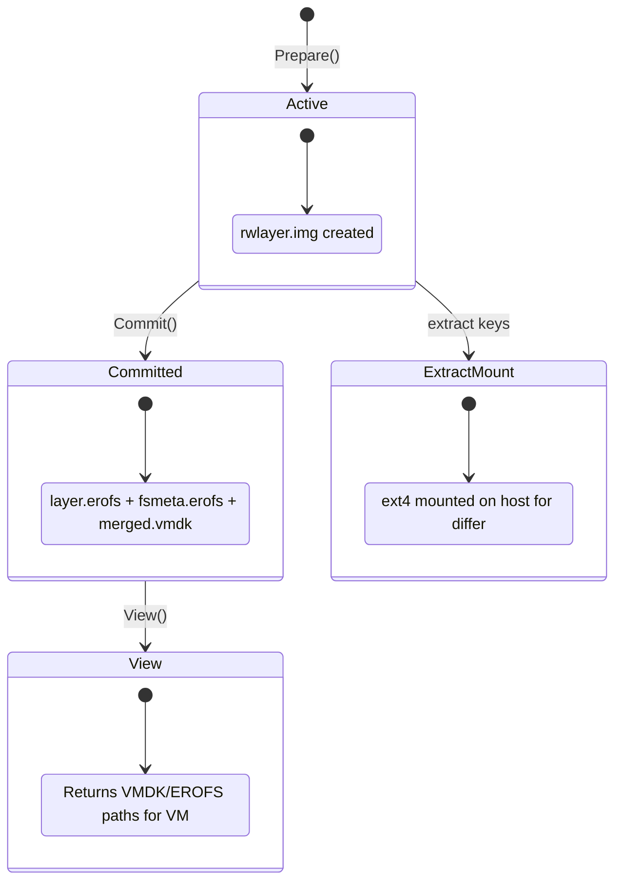

# Nexus EROFS

External snapshotter plugin for containerd designed exclusively for **VM-based container runtimes** (like [qemubox](https://github.com/aledbf/qemubox)). It stores container image layers as EROFS blobs and returns raw file paths for virtio-blk passthrough to VMs.

## Overview

Unlike traditional snapshotters that mount filesystems on the host, nexuserofs returns **raw file paths** that VM runtimes pass directly to guest VMs as block devices. The guest kernel handles all mounting internally.

```
Traditional Snapshotter:
  Host mounts overlay → Container sees mounted filesystem

Nexuserofs (VM-only):
  Host returns file paths → VM runtime passes as virtio-blk → Guest mounts internally
```

## Architecture



## How It Works

### Image Pull (Layer Extraction)

When pulling an image, containerd calls the EROFS differ to apply each layer:

```
1. Prepare("extract-sha256:abc...", parent)
   ├── Creates ext4 file (rwlayer.img)
   ├── Mounts ext4 on host via loop device
   └── Returns bind mount for fallback differs

2. EROFS differ converts tar stream directly to EROFS:
   ├── mkfs.erofs --tar=f reads tar from stdin → layer.erofs
   └── (Optional: --tar=i mode creates tar index + appends raw tar)

3. Commit("layer-sha256:abc...", "extract-sha256:abc...")
   ├── layer.erofs already exists (created by differ)
   ├── Unmounts ext4 (cleanup)
   └── Generates fsmeta.erofs + merged.vmdk (for multi-layer images)
```

**Note:** The ext4 mount is only used if a non-EROFS differ (e.g., walking differ) processes the layer. The EROFS differ bypasses this entirely by piping tar data directly to `mkfs.erofs`.

### Container Run

When running a container, the snapshotter returns raw file paths with mount options:

```go
// View (read-only) with VMDK - single fsmeta mount with device= options
// VM runtime detects merged.vmdk in same directory and uses it for QEMU
[]mount.Mount{{
    Type:   "erofs",
    Source: "/var/lib/nexuserofs/snapshots/123/fsmeta.erofs",
    Options: []string{"ro", "loop", "device=/path/to/layer1.erofs", "device=/path/to/layer2.erofs"},
}}

// View (read-only) single layer - returns EROFS layer directly
[]mount.Mount{{
    Type:    "erofs",
    Source:  "/path/to/layer.erofs",
    Options: []string{"ro", "loop"},
}}

// View (read-only) multi-layer fallback (when fsmeta generation fails)
// This happens when layers have incompatible block sizes (e.g., tar-index mode)
[]mount.Mount{
    {Type: "erofs", Source: "/path/to/layer1.erofs", Options: []string{"ro", "loop"}},
    {Type: "erofs", Source: "/path/to/layer2.erofs", Options: []string{"ro", "loop"}},
}

// Active (with writable layer) - EROFS lower + ext4 upper
[]mount.Mount{
    {Type: "erofs", Source: "/path/to/fsmeta.erofs", Options: []string{"ro", "loop", "device=..."}},
    {Type: "ext4",  Source: "/path/to/rwlayer.img",  Options: []string{"rw", "loop"}},
}
```

The VM runtime (qemubox) passes these as virtio-blk devices. The guest VM mounts them and creates an overlay.

**Fallback behavior:** When fsmeta/VMDK generation fails (e.g., `mkfs.erofs` lacks `--aufs` support, or layers have incompatible block sizes from `--tar=i` mode), the snapshotter returns individual EROFS mounts. The consumer must handle stacking these layers.

### VMDK: Single Virtual Disk for Multiple Layers

For multi-layer images, nexuserofs generates a **VMDK descriptor** that concatenates:
- `fsmeta.erofs` - Metadata-only EROFS referencing all layer blobs
- `layer1.erofs`, `layer2.erofs`, ... - Individual layer blobs

This allows QEMU to present all layers as a **single block device**, simplifying guest mounting:

```
merged.vmdk (descriptor)
├── fsmeta.erofs (metadata, maps to layer blobs)
├── layer-abc.erofs
├── layer-def.erofs
└── layer-123.erofs

Guest sees: /dev/vda (single device containing entire image)
```

### Container Commit

Creating a new image from a running container:

```bash
nerdctl --address /var/run/qemubox/containerd.sock \
    commit --snapshotter nexuserofs \
    container-name docker.io/user/image:tag
```

Flow:
```
1. Get active snapshot mounts (EROFS layers + mounted ext4 upper)

2. Differ compares lower (EROFS) vs upper (ext4) to produce tar diff

3. New layer committed:
   ├── ext4 upper directory → mkfs.erofs → new-layer.erofs
   ├── Unmount ext4
   └── Update image manifest with new layer
```

The commit reads from the **mounted ext4 writable layer** where container changes accumulated, converts to EROFS, and creates a new image layer.

## Snapshot Lifecycle



## Storage Layout

```
/var/lib/nexuserofs-snapshotter/
├── metadata.db              # BBolt database (snapshot metadata)
├── mounts.db                # BBolt database (mount manager state)
└── snapshots/
    └── {id}/
        ├── .erofslayer      # Marker file for EROFS differ
        ├── rwlayer.img      # ext4 writable layer file
        ├── rw/              # Mount point for ext4 (during extraction only)
        │   ├── upper/       # Overlay upper directory (fallback differs)
        │   └── work/        # Overlay work directory (fallback differs)
        ├── lower/           # Empty directory for View snapshots with no parent
        ├── layer.erofs      # Committed EROFS layer blob
        ├── fsmeta.erofs     # Merged metadata (multi-layer, requires --aufs)
        └── merged.vmdk      # VMDK descriptor for QEMU (requires --vmdk-desc)
```

## Requirements

### Runtime

- Linux kernel with EROFS support (5.4+)
- erofs-utils with the following features:
  - `--tar=f` or `--tar=i`: Convert tar streams directly to EROFS (required)
  - `--aufs`: AUFS-style whiteout handling for OCI layers (required)
  - `--vmdk-desc`: Generate VMDK descriptors for multi-layer images (required for fsmeta)
  - `-Enoinline_data`: Disable inline data for better block alignment
  - `--sort=none`: Skip data sorting when no compression (performance optimization)
- e2fsprogs (mkfs.ext4 for writable layers)
- util-linux (losetup for loop devices)
- containerd 2.0+

### erofs-utils

Each release includes a pre-built `mkfs.erofs` binary with all required features enabled. We recommend using this bundled version to ensure compatibility.

The bundled binary is built from the erofs-utils source with patches for features that may not yet be in upstream releases (like `--vmdk-desc`).

To verify feature support:

```bash
# Check for tar mode support
mkfs.erofs --help | grep -q '\-\-tar=' && echo "tar mode: OK"

# Check for VMDK descriptor support
mkfs.erofs --help | grep -q '\-\-vmdk-desc' && echo "vmdk-desc: OK"
```

### Build

- Go 1.23+
- [Task](https://taskfile.dev)

## Building

```bash
task build
```

Or cross-compile for Linux:

```bash
task build-linux
```

## Running

```bash
sudo ./bin/nexuserofs-snapshotter \
  --root /var/lib/nexuserofs-snapshotter \
  --address /run/nexuserofs-snapshotter/snapshotter.sock \
  --containerd-address /run/containerd/containerd.sock
```

## Configuration

### containerd

```toml
# /etc/containerd/config.toml
version = 2

[proxy_plugins]
  [proxy_plugins.nexuserofs]
    type = "snapshot"
    address = "/run/nexuserofs-snapshotter/snapshotter.sock"

  [proxy_plugins.nexuserofs-diff]
    type = "diff"
    address = "/run/nexuserofs-snapshotter/snapshotter.sock"
```

### Snapshotter Flags

| Flag | Default | Description |
|------|---------|-------------|
| `--root` | `/var/lib/nexuserofs-snapshotter` | Root directory for snapshotter data |
| `--address` | `/run/nexuserofs-snapshotter/snapshotter.sock` | Unix socket address |
| `--containerd-address` | `/run/containerd/containerd.sock` | containerd socket |
| `--containerd-namespace` | `default` | containerd namespace to use |
| `--log-level` | `info` | Log level (debug, info, warn, error) |
| `--default-size` | `64M` | Size of ext4 writable layer (bytes) |
| `--enable-fsverity` | `false` | Enable fsverity for layer validation |
| `--set-immutable` | `true` | Set immutable flag on committed layers |
| `--mkfs-options` | | Extra options for mkfs.erofs (e.g., `-zlz4hc,12`) |
| `--version` | | Show version information |

### Layer Conversion and fsmeta

Layers are created using full conversion mode (`--tar=f`), which converts tar archives to EROFS format with 4096-byte blocks. This ensures compatibility with fsmeta merge, allowing multi-layer images to be consolidated into a single mount with a VMDK descriptor for efficient VM handling.

## Key Differences from Traditional Snapshotters

| Aspect | Traditional | nexuserofs (VM-only) |
|--------|-------------|----------------------|
| Mount location | Host kernel | Guest VM kernel |
| Returns | Mounted paths | Raw file paths |
| Overlay handling | Host overlayfs | Guest overlayfs |
| Layer format | Directory trees | EROFS blobs + VMDK |
| Use case | runc, crun | qemubox, Firecracker |

## Differences vs containerd's Built-in EROFS Snapshotter

containerd 2.0+ includes a built-in EROFS snapshotter. nexuserofs differs in several key ways:

| Aspect | containerd EROFS | nexuserofs |
|--------|------------------|------------|
| **Plugin type** | Built-in | External proxy plugin |
| **Target runtime** | Host containers (runc) | VM containers (qemubox) |
| **Layer conversion** | Requires pre-converted EROFS layers | Converts tar→EROFS on pull via differ |
| **Multi-layer handling** | Host overlayfs stacking | fsmeta + VMDK for single virtio-blk device |
| **Mount returns** | Mounted overlayfs paths | Raw file paths (no host mounting) |
| **Tar mode** | N/A | `--tar=f` (full) or `--tar=i` (index) |
| **VMDK generation** | No | Yes (always for multi-layer) |

### Why Use nexuserofs?

1. **VM-native design**: Returns file paths that map directly to virtio-blk devices
2. **On-the-fly conversion**: Converts standard OCI tar layers to EROFS during pull
3. **Single device for multi-layer**: VMDK descriptor lets QEMU present all layers as one block device
4. **No host overlayfs**: Guest VM handles all filesystem stacking internally

## License

Apache 2.0
