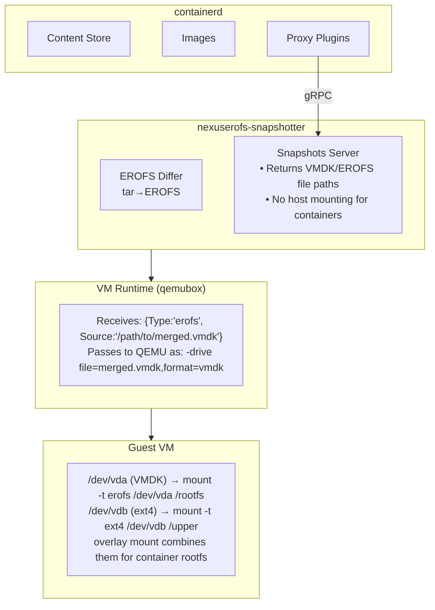
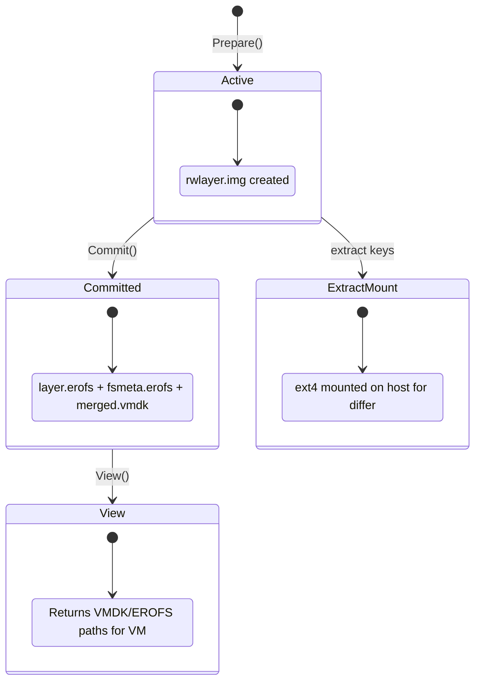

# Nexus EROFS

External snapshotter plugin for containerd designed exclusively for **VM-based container runtimes** (like [qemubox](https://github.com/aledbf/qemubox)). It stores container image layers as EROFS blobs and returns raw file paths for virtio-blk passthrough to VMs.

## Overview

Unlike traditional snapshotters that mount filesystems on the host, nexuserofs returns **raw file paths** that VM runtimes pass directly to guest VMs as block devices. The guest kernel handles all mounting internally.

```
Traditional Snapshotter:
  Host mounts overlay → Container sees mounted filesystem

Nexuserofs (VM-only):
  Host returns file paths → VM runtime passes as virtio-blk → Guest mounts internally
```

## Architecture



## How It Works

### Image Pull (Layer Extraction)

When pulling an image, containerd calls the snapshotter to prepare space for each layer:

```
1. Prepare("extract-sha256:abc...", parent)
   ├── Creates ext4 file (rwlayer.img)
   ├── Mounts ext4 on host via loop device
   └── Returns bind mount to mounted directory

2. Differ extracts tar content to mounted directory

3. Commit("layer-sha256:abc...", "extract-sha256:abc...")
   ├── Runs mkfs.erofs to convert directory → layer.erofs
   ├── Unmounts ext4
   └── Generates fsmeta.erofs + merged.vmdk for multi-layer images
```

### Container Run

When running a container, the snapshotter returns raw file paths:

```go
// View (read-only) - returns VMDK pointing to all EROFS layers
[]mount.Mount{{
    Type:   "erofs",
    Source: "/var/lib/nexuserofs/snapshots/123/fsmeta.erofs",
    // VM runtime detects merged.vmdk in same directory
}}

// Active (with writable layer) - returns EROFS layers + ext4 file
[]mount.Mount{
    {Type: "erofs", Source: "/path/to/layer1.erofs", Options: []string{"ro"}},
    {Type: "erofs", Source: "/path/to/layer2.erofs", Options: []string{"ro"}},
    {Type: "ext4",  Source: "/path/to/rwlayer.img",  Options: []string{"rw"}},
}
```

The VM runtime (qemubox) passes these as virtio-blk devices. The guest VM mounts them and creates an overlay.

### VMDK: Single Virtual Disk for Multiple Layers

For images with multiple layers, nexuserofs generates a **VMDK descriptor** that concatenates:
- `fsmeta.erofs` - Metadata-only EROFS referencing all layer blobs
- `layer1.erofs`, `layer2.erofs`, ... - Individual layer blobs

This allows QEMU to present all layers as a **single block device**, simplifying guest mounting:

```
merged.vmdk (descriptor)
├── fsmeta.erofs (metadata, maps to layer blobs)
├── layer-abc.erofs
├── layer-def.erofs
└── layer-123.erofs

Guest sees: /dev/vda (single device containing entire image)
```

### Container Commit

Creating a new image from a running container:

```bash
nerdctl commit --snapshotter nexuserofs container-name docker.io/user/image:tag
```

Flow:
```
1. Get active snapshot mounts (EROFS layers + mounted ext4 upper)

2. Differ compares lower (EROFS) vs upper (ext4) to produce tar diff

3. New layer committed:
   ├── ext4 upper directory → mkfs.erofs → new-layer.erofs
   ├── Unmount ext4
   └── Update image manifest with new layer
```

The commit reads from the **mounted ext4 writable layer** where container changes accumulated, converts to EROFS, and creates a new image layer.

## Snapshot Lifecycle



## Storage Layout

```
/var/lib/nexuserofs-snapshotter/
├── metadata.db              # BBolt database (snapshot metadata)
└── snapshots/
    └── {id}/
        ├── .erofslayer      # Marker file for EROFS differ
        ├── fs/              # (unused in block mode)
        ├── rwlayer.img      # ext4 writable layer file
        ├── rw/              # Mount point for ext4 (during extraction)
        │   ├── upper/       # Overlay upper directory
        │   └── work/        # Overlay work directory
        ├── layer.erofs      # Committed EROFS layer blob
        ├── fsmeta.erofs     # Merged metadata (multi-layer)
        └── merged.vmdk      # VMDK descriptor for QEMU
```

## Requirements

### Runtime

- Linux kernel with EROFS support (5.4+)
- erofs-utils 1.8+ (mkfs.erofs with `--aufs` support for layer merging)
- e2fsprogs (mkfs.ext4 for writable layers)
- util-linux (losetup for loop devices)
- containerd 2.0+

### Build

- Go 1.23+
- [Task](https://taskfile.dev)

## Building

```bash
task build
```

Or cross-compile for Linux:

```bash
task build-linux
```

## Running

```bash
sudo ./bin/nexuserofs-snapshotter \
  --root /var/lib/nexuserofs-snapshotter \
  --address /run/nexuserofs-snapshotter/snapshotter.sock \
  --containerd-address /run/containerd/containerd.sock
```

## Configuration

### containerd

```toml
# /etc/containerd/config.toml
version = 2

[proxy_plugins]
  [proxy_plugins.nexuserofs]
    type = "snapshot"
    address = "/run/nexuserofs-snapshotter/snapshotter.sock"

  [proxy_plugins.nexuserofs-diff]
    type = "diff"
    address = "/run/nexuserofs-snapshotter/snapshotter.sock"
```

### Snapshotter Flags

| Flag | Default | Description |
|------|---------|-------------|
| `--root` | `/var/lib/nexuserofs-snapshotter` | Root directory for snapshotter data |
| `--address` | `/run/nexuserofs-snapshotter/snapshotter.sock` | Unix socket address |
| `--containerd-address` | `/run/containerd/containerd.sock` | containerd socket |
| `--default-size` | `64M` | Size of ext4 writable layer |
| `--fs-merge-threshold` | `5` | Layer count threshold for generating fsmeta+VMDK (0 to disable) |
| `--enable-fsverity` | `false` | Enable fsverity for layer validation |
| `--set-immutable` | `true` | Set immutable flag on committed layers |
| `--mkfs-options` | | Extra options for mkfs.erofs (e.g., `-zlz4hc,12`) |
| `--version` | | Show version information |

## Usage with qemubox

```bash
# Pull image (layers converted to EROFS)
ctr --address /var/run/qemubox/containerd.sock \
    pull --snapshotter nexuserofs \
    ghcr.io/aledbf/qemubox/sandbox:latest

# Run container (VMDK passed to VM as virtio-blk)
ctr --address /var/run/qemubox/containerd.sock \
    run -t --snapshotter nexuserofs \
    --runtime io.containerd.qemubox.v1 \
    ghcr.io/aledbf/qemubox/sandbox:latest mycontainer

# Commit changes to new image
nerdctl --address /var/run/qemubox/containerd.sock \
    commit --snapshotter nexuserofs \
    mycontainer docker.io/user/sandbox:modified
```

## Key Differences from Traditional Snapshotters

| Aspect | Traditional | nexuserofs (VM-only) |
|--------|-------------|----------------------|
| Mount location | Host kernel | Guest VM kernel |
| Returns | Mounted paths | Raw file paths |
| Overlay handling | Host overlayfs | Guest overlayfs |
| Layer format | Directory trees | EROFS blobs + VMDK |
| Use case | runc, crun | qemubox, Firecracker |

## License

Apache 2.0
